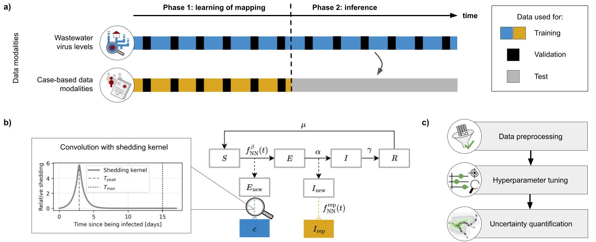

## Code for the paper "A wastewater-informed neural compartmental model for long-horizon case number projections"

### Method overview
This repository presents a susceptible–exposed–infectious–recovered (SEIR) universal differential equation that links wastewater viral loads to case counts and embeds neural networks to represent time-varying parameters. Using ensembles, it quantifies uncertainty.

Applied to newly generated COVID-19 data from Bonn (Germany), it produces plausible out-of-sample projections of case counts over a reconstruction horizon of up to 50 weeks. Across five cities in Rhineland-Palatinate, it learns city-specific mappings to prevalence that generalise within each locale.

Compared with SEIR models with fixed transmission, the UDE captures non-stationary drivers (policy, behaviour, seasonality) without sacrificing epidemiological structure, while propagating observation and model uncertainty into the projections.

### Contents of this repository
- `data`: (original and preprocessed) data, data-loading utilities, etc.
- `preprocessing`: code for data preprocessing
- `model_definition`: definition of UDE model(s)
- `optimization`: code for hyperparameter optimisation and multistart runs used to generate ensembles
- `analysis`: data analysis scripts and post-processing scripts for summarising, analysing, and visualising results from hyperparameter optimisation and ensemble multistart runs

### Quickstart
To use the framework:
1. Set up a virtual environment (using `requirements.txt`).
2. Conduct hyperparameter optimisation (e.g. `python optimization/two_phase_integrative_ude_optuna.py --phase_cut_date 2023-03-15 --objective cases_and_conc`).
3. Use the results from step 2 to perform multistart optimisation (e.g. `python optimization/two_phase_integrative_ude_multistart.py --phase_cut_date 2023-03-15 --seed_batch $SLURM_ARRAY_TASK_ID --n_days_pred_conc 0`).
4. Evaluate the results (`python analysis/models/multistart_create_metric_df.py --phase_cut_date 2024-01-31 --town Bonn` and `python analysis/models/eval_multistart.py --phase_cut_date 2024-01-31 --cutoff_value 0.05 --town Bonn`).

These Python scripts must be executed for each phase cut date, objective function, and city of interest. Note that for all Rhineland-Palatinate cities, the suffix `_sentisurv` must be added to the Python filenames. This provides an alternative data loading scheme that allows for multiple cities in one dataset. To use the framework for new datasets, data preprocessing has to be customized to fit the data format of the preprocessed Bonn or preprocessed Rhineland-Palatinate datasets. 

### Data availability
This repository contains the data for Bonn (both preprocessed and raw), as well as a preprocessing script for the data for Rhineland-Palatinate (containing code that automatically retreive the data using URLs). 
